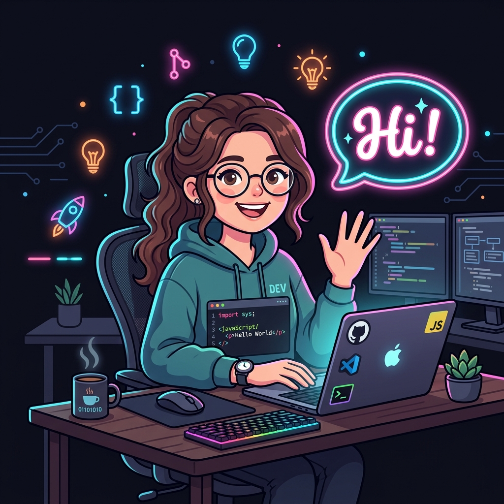

  <!-- Animated Gradient Header using a widely used public Dev GIF -->
  

  

    
  

  

    
  

  
  
   

 

## 👩‍💻 About Me

I'm a passionate **Software Developer and AI Enthusiast** who enjoys building impactful projects using modern technologies. I love bringing ideas to life through elegant code and intelligent architecture.

- 🚀 **Currently Focusing On:** Advanced AI algorithms, full-stack Next.js applications, and problem-solving through competitive programming.
- 🧠 **Learning:** Deep Dive into Machine Learning models and highly scalable cloud architectures.
- 💬 **Ask me about:** JavaScript, Python, UI/UX Design, and building AI tools!
- ⚡ **Fun fact:** I love experimenting with new dev tools and optimizing code for absolute maximum performance.

 

## 🛠️ Tech Stack & Tools

  <h3>💻 Core Languages</h3>
  
  
    
  
  <h3>🌐 Frontend & UI</h3>
  
  
    
  
  <h3>⚙️ Backend & Databases</h3>
  
  
    
  
  <h3>🧠 AI & Machine Learning</h3>
  

    

  <h3>☁️ Tools & Cloud Infrastructure</h3>
  

 

## 📊 GitHub Analytics

  
  

  

  <!-- Animated Activity Graph -->
  

 

## 🚀 Live Projects

  
  

  

 

  

